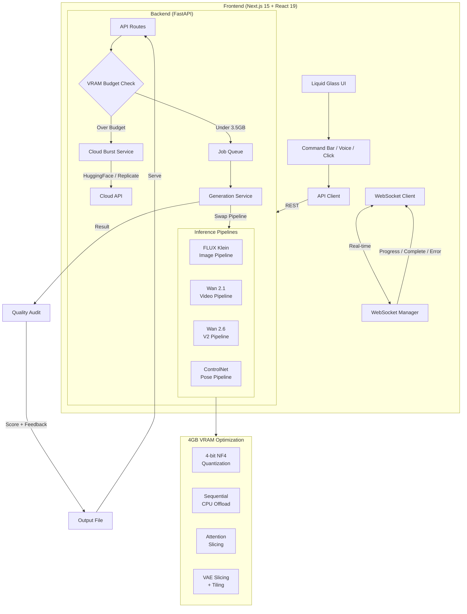
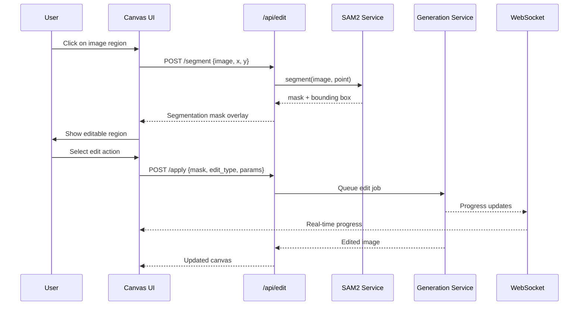

<div align="center">

# AuraGen

### Neural-Powered Image & Video Generation Platform

*Local-first AI generation for consumer GPUs. Zero cloud cost. Full privacy. Unlimited creativity.*

[](LICENSE)
[](https://python.org)
[](https://nextjs.org)
[](https://fastapi.tiangolo.com)

[**GitHub Repository**](https://github.com/LEKKALAGANESH/Image-Video-Generation)

</div>

---

## Overview

AuraGen is a premium AI platform for image and video generation that runs entirely on consumer NVIDIA GPUs with as little as 4GB VRAM. It combines **FLUX.1-schnell** for fast high-fidelity text-to-image synthesis (~2s per image), **Wan 2.1 1.3B** for text-to-video generation with **CogVideoX-2b** auto-fallback, **SAM2** for interactive point-to-edit segmentation, and a **Liquid Glass UI** built with Next.js 15 and React 19. Every model is quantized to 4-bit NF4 precision and orchestrated through a single-pipeline architecture so the entire stack fits within a strict VRAM budget. When local hardware is insufficient, an optional cloud burst system transparently routes heavy image workloads to HuggingFace or Replicate APIs -- zero manual intervention required.

### Key Features

- **Responsive Canvas Gallery** -- CSS Grid layout with mode-colored cards (violet=image, rose=video), fullscreen lightbox with prev/next navigation, and video play/pause controls
- **Auto-Download** -- Generated content automatically downloads to your device with prompt-based filenames (e.g., `sunset-over-mountains-a3b2c1d4.png`)
- **Local-First Storage** -- OPFS + IndexedDB for offline gallery access that survives page refreshes
- **Network-Aware Delivery** -- Adaptive media quality based on real-time bandwidth detection (thumbnail/preview/full)
- **Keyboard Accessible** -- Full keyboard navigation, skip-to-content, focus-visible rings, screen reader support
- **Responsive Design** -- 8 breakpoints from 320px mobile to 4K (2560px+) with fluid typography and spacing
- **Real-Time Progress** -- SSE-based live progress with Neural Pulse animations and three-phase progress indicator
- **Voice Commands** -- Browser Speech Recognition for hands-free generation
- **Unified Notifications** -- Bell icon dropdown with GPU status, auto-download info, and system alerts

---

## Hardware Prerequisites

### Minimum Requirements

| Component | Specification |
|-----------|---------------|
| **GPU** | NVIDIA with 4GB VRAM (GTX 1650, RTX 3050) |
| **RAM** | 16 GB system memory (CPU offloading stores model layers in RAM) |
| **CUDA** | 11.8 or higher |
| **Python** | 3.10+ |
| **Node.js** | 18+ |
| **Storage** | ~15 GB for model weights |

### Recommended

| Component | Specification |
|-----------|---------------|
| **GPU** | 8GB+ VRAM (RTX 3060 12GB, RTX 4060, RTX 4070) |
| **RAM** | 32 GB system memory |
| **Storage** | SSD for faster model loading and inference I/O |

A dedicated NVIDIA GPU is required. Integrated graphics and AMD/Intel GPUs are not supported for local inference. The hybrid cloud burst feature can offload heavy jobs to HuggingFace or Replicate APIs when local VRAM is insufficient.

### 8-Device Scaling Matrix

AuraGen's SCSS token system drives a fully responsive layout across eight device classes. The UI adapts grid density, typography, scrollbar sizing, and component proportions at every breakpoint:

| Device Class | Viewport | Grid Cols | Font Scale | Scrollbar | Target |
|---|---|---|---|---|---|
| Tiny | 320px | 1 | 0.625rem | 6px | Small phones |
| Phone | 480px | auto-fit | -- | -- | Standard phones |
| Phablet | 600px | auto-fit | -- | -- | Large phones |
| Tablet | 768px | 2 | -- | -- | Tablets |
| Laptop | 1024px | 3 | -- | -- | Laptops |
| Desktop | 1280px | 4 | -- | -- | Standard desktops |
| Wide | 1536px | 5 | -- | -- | Wide screens |
| Ultra/4K | 3840px | 6 | 6rem | 12px | 4K displays |

> **Note:** Font sizes use fluid `clamp()` and scale continuously between 320px and 3840px. There are no hard breakpoint jumps -- every viewport width produces a proportionally correct size.

---

## The 4GB Optimization Stack

AuraGen is purpose-built to run state-of-the-art generative AI models on consumer GPUs with as little as 4GB of VRAM. Eight interlocking techniques work together to reduce peak VRAM consumption by over 75%.

### 1. 4-bit NF4 Quantization

Models are loaded via `bitsandbytes` in NF4 (Normal Float 4-bit) format. This compresses every weight tensor from 16-bit floating point to 4-bit, reducing VRAM by approximately 75% with minimal quality loss. FLUX Klein drops from ~12.8 GB in fp16 to ~3.2 GB in 4-bit.

### 2. Sequential CPU Offloading

Calling `enable_sequential_cpu_offload()` on each pipeline moves inactive model layers to system RAM during inference. Only the currently executing layer resides in VRAM, creating a streaming execution pattern that dramatically reduces peak memory.

### 3. Attention Slicing

`enable_attention_slicing()` processes self-attention computations in sequential chunks rather than a single monolithic operation. This trades a small amount of speed for a significant reduction in peak VRAM during the attention passes of the UNet.

### 4. VAE Slicing + Tiling

Video VAE decoding is chunked both spatially (tiling) and temporally (slicing) to prevent the large intermediate tensors from spiking VRAM. Each tile is decoded independently and stitched together on the CPU side.

### 5. Single Pipeline Architecture

Only ONE model is loaded into VRAM at a time. The `GenerationService` singleton automatically unloads the current pipeline and loads the requested one (image, video, video V2, or ControlNet) before each job begins. No concurrent model residency.

### 6. Single Job Queue

An `asyncio.Queue` serializes all generation requests. Only one job executes at a time, eliminating any possibility of concurrent GPU memory contention or OOM crashes.

### 7. VRAM Budget Estimation

The cloud burst service estimates VRAM requirements before dispatching each job. If a request would exceed the configured `VRAM_BUDGET_MB` (default: 3500 MB), the job is transparently routed to HuggingFace Inference API or Replicate instead of running locally.

### 8. torch.compile + max-autotune

On supported hardware (Ampere architecture and later), `torch.compile()` with the `max-autotune` backend JIT-compiles inference graphs for optimal kernel selection, yielding measurable speed improvements without additional VRAM cost.

### VRAM Usage Comparison

| Model | fp16 | 4-bit NF4 | Savings |
|---|---|---|---|
| FLUX Klein | ~12.8 GB | ~3.2 GB | 75% |
| Wan 2.1 1.3B | ~2.6 GB | ~1.8 GB | 31% |
| ControlNet OpenPose | ~1.4 GB | ~0.7 GB | 50% |
| SAM2 Hiera Tiny | ~0.15 GB | ~0.15 GB | N/A |

---

## High-End UI Features

### Liquid Glassmorphism Theme

AuraGen's visual identity is built on a comprehensive glassmorphism design system:

- **Dark glass panels** with `backdrop-filter: blur(20px)` and white alpha borders that simulate refractive depth
- **CSS Houdini `@property` declarations** for animatable custom properties: `--neural-glow`, `--glass-blur`, `--morph-radius`, `--depth-scale`
- **4 glass variants:**
  - *Frosted* -- Standard blur with subtle transparency
  - *Tinted* -- Color-shifted glass with theme accent bleed-through
  - *Noise* -- SVG fractal noise texture overlay for organic tactile depth
  - *Prismatic* -- Rotating conic gradient border that shifts with cursor proximity
- **6-level depth system** with progressive scale, blur, opacity, and shadow values that create convincing z-axis layering across all surfaces

### Fluid Scaling System (Sprint 5 SASS Tokens)

The styling architecture uses a modular SCSS token system designed for pixel-perfect rendering across all 8 device classes:

- **`_tokens.scss`** -- 8 breakpoints, Golden Ratio (1.618) spacing scale with 11 steps (`space-0` through `space-10`), 7 fluid typography levels via `clamp()`, color tokens, transition tokens, and glass blur tokens
- **`_components.scss`** -- Glass Cards (with `--tinted` and `--interactive` variants), Buttons (with viewport-responsive glow radius and `--primary`, `--ghost`, `--sm`, `--lg` variants), Tabs, Headings (5 tiers from `--h3` to `--hero`), Inputs, and Labels
- **`Grid.scss`** -- CSS Grid from 1 column (mobile) to 6 columns (4K), golden-ratio gap spacing, column span utilities (`aura-col-span-2` through `aura-col-span-6`), and Neural Pulse scrollbar with animated glow track
- **Font sizes** range from `clamp(0.625rem, ..., 0.875rem)` for micro text to `clamp(2.5rem, ..., 6rem)` for hero headings

### Animations & Effects

| Animation | Description |
|-----------|-------------|
| **Neural Pulse** | Expanding concentric rings + core pulse + floating ambient particles |
| **Glass Shimmer** | Horizontal gradient sweep across panel surfaces |
| **Morphing Border** | Animated `border-radius` cycling through organic shapes |
| **Hologram Flicker** | Opacity and chromatic aberration flicker effect |
| **Scanline Overlay** | CRT-style horizontal scanlines with transparency |
| **Data Stream** | Vertical scrolling code-rain effect for loading states |
| **Prismatic Border** | Rotating conic-gradient border with continuous hue cycling |
| **Spring Physics** | Framer Motion spring animations on all interactive elements |

### Interactive Features

- **Morphing Canvas** -- Spatial depth layers with ambient particles and connection lines that respond to scroll position and cursor movement. Creates a living background that adapts to UI state changes.
- **Voice Commands** -- WebSpeech API enables hands-free generation. Say "generate image of a sunset over mountains" and AuraGen transcribes, parses, and dispatches the request automatically.
- **Semantic Command Bar** -- Press `Ctrl+K` to open a natural language command palette. Describe what you want in plain English and the system routes to the correct generation endpoint with extracted parameters.
- **Point-to-Edit** -- Click any region of a generated image to invoke SAM2 segmentation, producing an editable mask overlay with AI-suggested edit actions (recolor, replace, enhance, remove).

---

## The Scrum Multi-Agent Workflow

AuraGen was built using a **multi-agent Scrum methodology** where each sprint deploys specialized AI agents working in parallel on designated files. Each agent operates autonomously within its scope, and integration is verified post-sprint through automated fulfillment audits.

### Sprint 1 -- Core Platform

**Agents:** Design Agent, Architect Agent, Inference Agent, UX Agent

Delivered the foundational system: FastAPI backend with WebSocket real-time communication, async single-job queue with OOM prevention, FLUX Klein image pipeline and Wan 2.1 video pipeline (both with 4-bit quantization and CPU offload), SAM2 point-to-edit segmentation, and the React 19 frontend with the initial Liquid Glass theme.

### Sprint 3 -- 2026 Pro Upgrade

**Agents:** Infrastructure Agent (Cloud + Audio), SOTA Model Agent (Wan 2.6 + ControlNet), Design Agent (Morphing UI + Voice), Audit Agent (Quality + Roadmap)

Added Hybrid Cloud Burst routing (HuggingFace/Replicate), Audio Synth service (pure Python waveform generation from prompts), Wan 2.6 Distilled V2 video pipeline with physics simulation modes, ControlNet OpenPose pose-to-image generation, Morphing Canvas with spatial depth particles, Voice Commands via WebSpeech API, Semantic Command Bar, and the Quality Audit system with 7 image checks and 3 video checks.

### Sprint 4 -- Models & Styles

**Agents:** DevOps Agent (setup_models.py), Frontend Style Agent (global.css + theme.ts), Quality Audit Agent (folder scan), Integration Agent (fulfillment check)

Delivered `setup_models.py` for automated model weight downloading, `global.css` and `theme.ts` for consolidated theming with design tokens and utility functions, folder auditing infrastructure, and cross-agent fulfillment verification.

### Sprint 5 -- SASS Token Scaling

**Agents:** Token Architect (_tokens.scss), Component Specialist (_components.scss), Layout Coordinator (MainLayout + Grid), Fulfillment Audit Agent

Built the complete SCSS design token system: `_tokens.scss` with Golden Ratio spacing and fluid `clamp()` typography across 8 breakpoints, `_components.scss` with 6 glassmorphism components, `Grid.scss` with the responsive grid system and Neural Pulse scrollbar, and `MainLayout.tsx` as the reusable layout wrapper.

### Sprint 6 -- Documentation & Polish

**Agents:** Technical Writer, Automation (DevOps), UX Audit (Mermaid diagrams)

Producing this comprehensive README.md with Mermaid architecture diagrams, automated setup scripting, and UX audit against the 8-device scaling matrix.

---

## Visual Data Flow

The following diagram illustrates the complete request lifecycle from the frontend through inference and back to the user.



### Point-to-Edit Interaction Flow



---

## Project Structure

```
backend/
  main.py                             # FastAPI entry point (all routers registered)
  setup_models.py                     # Automated model weight downloader
  requirements.txt                    # Python dependencies
  core/
    config.py                         # Pydantic settings (models, VRAM, cloud, V2)
  api/
    routes.py                         # /api/generate/image, /api/generate/video, /api/jobs
    schemas.py                        # Request/response models
    edit_routes.py                    # /api/edit/segment, /api/edit/apply, /api/edit/suggestions
    edit_schemas.py                   # Edit endpoint models
    audio_routes.py                   # /api/audio/generate, /api/audio/attach
    audit_routes.py                   # /api/audit/image, /api/audit/video, /api/audit/log
    controlnet_routes.py              # /api/generate/pose-to-image, /api/pose/detect
  backend_queue/
    job_queue.py                      # Async single-job queue (OOM prevention)
  websocket/
    manager.py                        # WebSocket connection manager
  inference/
    image_pipeline.py                 # FLUX Klein pipeline (4-bit, CPU offload)
    video_pipeline.py                 # Wan 2.1 1.3B pipeline (VAE slicing/tiling)
    video_pipeline_v2.py              # Wan 2.6 Distilled (physics modes, DPM solver)
    controlnet_pipeline.py            # ControlNet OpenPose pose-to-image
  services/
    generation_service.py             # Singleton -- one pipeline in VRAM at a time
    segmentation_service.py           # SAM2 point-based segmentation
    cloud_burst_service.py            # Hybrid cloud routing (HF/Replicate)
    audio_synth_service.py            # Prompt-based ambient SFX generation
    quality_audit_service.py          # Physical plausibility checker
    auto_audit_hook.py                # Post-generation quality hook
  models/
    flux/                             # FLUX Klein model weights
    wan/                              # Wan 2.1 / 2.6 model weights
    controlnet/                       # ControlNet OpenPose weights
    sam2/                             # SAM2 Hiera Tiny weights
  outputs/
    log_improvements.json             # Quality failure log for fine-tuning

frontend/
  package.json                        # Dependencies (Next.js 15, React 19, sass, etc.)
  tailwind.config.ts                  # Tailwind CSS configuration
  src/
    app/
      layout.tsx                      # Root layout with providers
      page.tsx                        # Main generation page
      globals.css                     # Global CSS imports
    styles/
      global.css                      # Houdini @property, depth system, glass variants
      theme.ts                        # Design tokens + utility functions
      _tokens.scss                    # Breakpoints, fluid typography, Golden Ratio spacing
      _components.scss                # Cards, Buttons, Tabs, Headings, Inputs
      Grid.scss                       # Responsive grid + Neural Pulse scrollbar
      App.scss                        # Master SCSS entry point
      _index.scss                     # Module forwarding
    components/
      canvas/
        MorphingCanvas.tsx            # Spatial depth canvas with particles
        SpatialCanvas.tsx             # Original canvas (preserved)
        PointToEdit.tsx               # Click-to-segment overlay
        SegmentOverlay.tsx            # Mask visualization
      command-bar/
        CommandBar.tsx                # Ctrl+K semantic command palette
      layout/
        MainLayout.tsx                # Responsive grid wrapper (aura-grid + aura-scroll)
        Sidebar.tsx                   # Image/Video/Pose mode parameters
      ui/
        VoiceCommand.tsx              # WebSpeech API voice control
        GlassPanel.tsx                # Reusable glass container
        GlowButton.tsx                # Animated button
        EditPanel.tsx                 # Floating edit actions
        SemanticInput.tsx             # NLP cycling-placeholder input
      animations/
        NeuralPulse.tsx               # Premium loading animation
    hooks/
      useWebSocket.ts                 # Auto-reconnect WebSocket
      useGenerationStore.ts           # Zustand store (image/video/pose)
      usePointToEdit.ts               # Edit mode state
      useVoiceCommand.ts              # WebSpeech API hook
    lib/
      api.ts                          # API client (generate, audit, audio, pose)
    types/
      index.ts                        # TypeScript interfaces

fulfillment_check.txt                 # Sprint fulfillment verification
LICENSE                               # MIT License
README.md                             # This file
```

---

## API Endpoints

AuraGen exposes 17 REST endpoints and 1 WebSocket endpoint through the FastAPI backend:

| Method | Endpoint | Description |
|--------|----------|-------------|
| GET | `/api/health` | Health check with queue status and connection info |
| POST | `/api/generate/image` | Queue an image generation job |
| POST | `/api/generate/video` | Queue a video generation job |
| GET | `/api/jobs/{job_id}` | Get job status and result |
| POST | `/api/jobs/{job_id}/cancel` | Cancel a pending or running job |
| GET | `/api/outputs/{filename}` | Serve a generated file |
| POST | `/api/edit/segment` | Run SAM2 segmentation at a click point |
| POST | `/api/edit/apply` | Queue an edit job on a segmented region |
| GET | `/api/edit/suggestions` | Get AI-suggested edits for a region |
| POST | `/api/generate/pose-to-image` | Generate image from pose skeleton |
| POST | `/api/pose/detect` | Detect pose skeleton from image |
| POST | `/api/audio/generate` | Generate ambient SFX from prompt |
| POST | `/api/audio/attach` | Mux audio onto video (stub) |
| POST | `/api/audit/image` | Run quality audit on an image |
| POST | `/api/audit/video` | Run quality audit on a video |
| GET | `/api/audit/log` | Get full quality failure log |
| GET | `/api/audit/stats` | Get audit summary statistics |

---

## WebSocket Protocol

Connect to `ws://localhost:8000/ws/{client_id}` to receive real-time job updates. The client ID can be any unique string. Three message types are emitted:

**Progress** -- sent at each inference step:
```json
{ "type": "progress", "job_id": "abc123", "data": { "progress": 42, "message": "Step 8/20" } }
```

**Complete** -- sent when a job finishes successfully:
```json
{ "type": "complete", "job_id": "abc123", "data": { "result_url": "/api/outputs/abc123.png" } }
```

**Error** -- sent when a job fails:
```json
{ "type": "error", "job_id": "abc123", "data": { "message": "Out of GPU memory." } }
```

The frontend `useWebSocket` hook handles automatic reconnection with exponential backoff.

---

## Configuration

All backend settings can be overridden via environment variables or a `.env` file in the `backend/` directory:

| Variable | Default | Description |
|----------|---------|-------------|
| `MODEL_IMAGE` | `xinsir/FLUX.1-Xlabs-Kelin` | HuggingFace model ID for image generation |
| `MODEL_VIDEO` | `Wan-AI/Wan2.1-T2V-1.3B` | HuggingFace model ID for video generation |
| `MODEL_VIDEO_V2` | `Wan-AI/Wan2.1-T2V-1.3B-Distilled` | V2 video model (Wan 2.6 Distilled) |
| `DEVICE` | `cuda` | PyTorch device |
| `QUANTIZE_4BIT` | `true` | Enable 4-bit NF4 quantization |
| `CPU_OFFLOAD` | `true` | Enable sequential CPU offloading |
| `MAX_IMAGE_SIZE` | `768` | Maximum image dimension (width or height) |
| `MAX_VIDEO_SIZE` | `480` | Maximum video dimension |
| `MAX_VIDEO_FRAMES` | `33` | Maximum number of video frames |
| `VIDEO_DEFAULT_FPS` | `16` | Default video framerate |
| `OUTPUT_DIR` | `./outputs` | Directory for generated files |
| `PORT` | `8000` | Server port |
| `MAX_QUEUE_SIZE` | `10` | Maximum pending jobs in queue |
| `USE_V2_PIPELINE` | `true` | Use Wan 2.6 Distilled for video |
| `CLOUD_ENABLED` | `false` | Enable hybrid cloud bursting |
| `CLOUD_PROVIDER` | `huggingface` | Cloud provider (`huggingface` or `replicate`) |
| `HF_API_TOKEN` | *(empty)* | HuggingFace API token for cloud burst |
| `VRAM_BUDGET_MB` | `3500` | VRAM budget in MB before cloud burst triggers |
| `BURST_THRESHOLD_IMAGE` | `1024` | Image dimension threshold for cloud burst |
| `BURST_THRESHOLD_FRAMES` | `60` | Frame count threshold for cloud burst |

---


## Quick Start

### 1. Backend Setup

```bash
# Clone and install dependencies
cd backend
pip install -r requirements.txt

# Download model weights (~12 GB total)
python setup_models.py

# Start the API server
python main.py                      # Starts at http://localhost:8000
```

The API server includes a simulated inference fallback so the full UI flow works without downloading model weights. Model weights are fetched automatically from HuggingFace on first real inference call, or can be pre-downloaded via `setup_models.py`.

### 2. Frontend Setup

```bash
cd frontend
npm install                         # Installs sass + all dependencies
npm run dev                         # Starts at http://localhost:3000
```

### 3. Open the App

Navigate to **http://localhost:3000** to access the Liquid Glass UI. The frontend connects to the backend via REST and WebSocket automatically.

### 4. Optional: Enable Cloud Bursting

To route high-resolution or high-frame-count jobs to cloud APIs when local VRAM is insufficient:

```bash
# Add to backend/.env
CLOUD_ENABLED=true
CLOUD_PROVIDER=huggingface
HF_API_TOKEN=hf_your_token_here
```

---

## Models

All models are free, open-source, and downloaded automatically from HuggingFace on first use (or pre-downloaded via `setup_models.py`):

| Model | Parameters | Use | License |
|-------|-----------|-----|---------|
| [FLUX Klein](https://huggingface.co/xinsir/FLUX.1-Xlabs-Kelin) | ~3B | Text-to-Image | Apache 2.0 |
| [Wan 2.1 T2V 1.3B](https://huggingface.co/Wan-AI/Wan2.1-T2V-1.3B) | 1.3B | Text-to-Video | Apache 2.0 |
| [Wan 2.1 T2V Distilled](https://huggingface.co/Wan-AI/Wan2.1-T2V-1.3B-Distilled) | 1.3B | Text-to-Video (V2) | Apache 2.0 |
| [ControlNet OpenPose](https://huggingface.co/lllyasviel/control_v11p_sd15_openpose) | ~360M | Pose-guided Generation | Apache 2.0 |
| [SAM2 Hiera Tiny](https://huggingface.co/facebook/sam2-hiera-tiny) | ~30M | Image Segmentation | Apache 2.0 |

---

## Troubleshooting

### Module Shadowing Errors (`queue`, `math`, `random`, etc.)

Python will import a local file or directory over a standard library module of the same name. If you see unexpected `ImportError` or `AttributeError` on well-known stdlib modules, check for naming conflicts:

```bash
# Common offenders — never name your files or folders:
queue.py   math.py   random.py   json.py   email/   test/   io.py   types.py   logging.py
```

**Symptoms:**
- `AttributeError: module 'queue' has no attribute 'Queue'`
- `ImportError: cannot import name 'deque' from 'collections'`
- Any stdlib import that mysteriously stops working

**Fix:** Rename the conflicting file/folder and update all imports. This project originally had a `backend/queue/` directory that shadowed Python's `queue` module — it was renamed to `backend/backend_queue/`.

### "No CUDA detected" / `torch.cuda.is_available()` returns False

1. **Verify NVIDIA drivers are installed:**
   ```bash
   nvidia-smi
   ```
   If `nvidia-smi` is not found, install the latest drivers from [nvidia.com/drivers](https://www.nvidia.com/drivers).

2. **Install the correct PyTorch build.** PyTorch ships CPU-only by default. You must install the CUDA variant:
   ```bash
   # For Python 3.14 + CUDA 12.8 (latest):
   pip install torch torchvision --index-url https://download.pytorch.org/whl/cu128

   # For Python 3.10-3.13 + CUDA 12.6:
   pip install torch torchvision --index-url https://download.pytorch.org/whl/cu126

   # For Python 3.10-3.12 + CUDA 12.1 (legacy):
   pip install torch torchvision --index-url https://download.pytorch.org/whl/cu121
   ```
   Check available builds at [pytorch.org/get-started](https://pytorch.org/get-started/locally/).

3. **Verify:**
   ```python
   import torch
   print(torch.cuda.is_available())       # Should be True
   print(torch.cuda.get_device_name(0))   # Should show your GPU name
   ```

### Model Downloads Fail

- Ensure `huggingface_hub` is up to date: `pip install -U huggingface_hub`
- For gated models, set your token: `huggingface-cli login`
- Check disk space (~15 GB needed for all models)
- Downloads are resumable — re-run `python setup_models.py` to continue

### Out of Memory (OOM) During Generation

- Ensure `QUANTIZE_4BIT=true` and `CPU_OFFLOAD=true` in `backend/.env`
- Reduce image dimensions (max 512x512 for 4GB GPUs)
- Reduce video frames (max 17 frames for 4GB GPUs)
- Enable cloud bursting for heavy jobs: `CLOUD_ENABLED=true`

---

## License

This project is licensed under the **MIT License**. See [LICENSE](LICENSE) for details.

---

<div align="center">

*Built with multi-agent Scrum methodology across 7 sprints.*

**AuraGen** -- Local-first neural generation for everyone.

</div>
